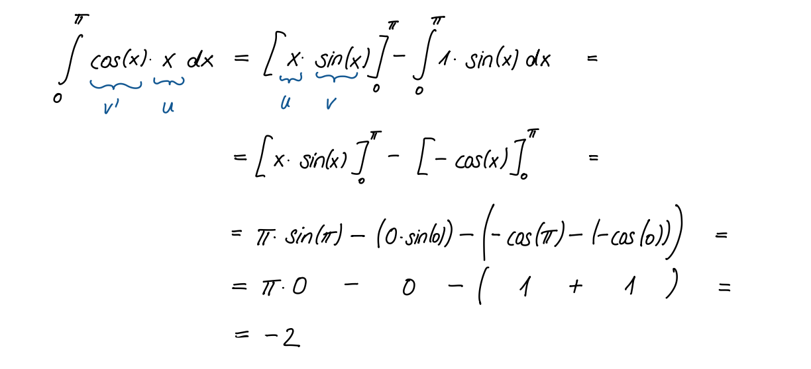

# Übungen

```{admonition} Warnung
:class: warning
Achtung, dieser Abschnitt des Vorlesungsskriptes wird gerade überarbeitet!!!
```

```{admonition} Übung 1.1
:class: miniexercise
Integrieren Sie 

$$\int_{-1}^{3} x\sqrt{x+1}\, dx$$

einmal mittels partieller Integration und einmal mit der Substitutionsregel. 

Tipp: partielle Integration: $u(x)=x$; Substitution: $x = z - 1$.
```

````{admonition} Lösung
:class: minisolution, toggle

$$\int_{-1}^{3} x\sqrt{x+1}\, dx = \frac{112}{15} \approx 7.4667.$$
```{dropdown} Lösungsweg
partielle Integration: $\quad \int_{a}^{b} u(x)v'(x)\, dx = \left[u(x)v(x)\right]_{a}^{b} - \int u'(x)v(x)\, dx$ 
\begin{align*}
u(x)=x & \quad \Rightarrow u'(x) = 1\\
 v'(x)=\sqrt{x+1} & \quad \Rightarrow v(x)=\int v'(x)\, dx = \int \sqrt{x+1}\, dx = \frac{2}{3}(x+1)^{\frac{3}{2}} 
\end{align*}
Wir setzen in die partielle Integrationsregel ein:

$$\int \underbrace{x}_{u(x)}\underbrace{\sqrt{x+1}}_{v'(x)}\, dx = \underbrace{x}_{u(x)}\cdot \underbrace
{\frac{2}{3}(x+1)^{\frac{3}{2}}}_{v(x)} - \int \underbrace{1}_{u'(x)}\cdot\underbrace{\frac{2}{3}(x+1)^{\frac{3}{2}}}_{v(x)}\, dx =
\frac{2}{3}x(x+1)^{\frac{3}{2}} - \frac{4}{15}(x+1)^{\frac{5}{2}}+C$$

Substitution: $\quad z = x + 1 \quad \Rightarrow \frac{dz}{dx} = 1 \quad \Rightarrow dx = 1\, dz$ 

Wir substituieren:

\begin{multline*}
\int x\sqrt{x+1}\, dx = \int (z-1)\sqrt{z}\cdot 1 \, dz = \int (z-1) z^{\frac{1}{2}}\, dz = \\
= \int z^{\frac{3}{2}}\, dz - \int z^{\frac{1}{2}}\, dz = \frac{2}{5}z^{\frac{5}{2}} - \frac{2}{3}z^{\frac{3}{2}} + C 
\end{multline*}

Rücksubstitution:

$$\int x\sqrt{x+1}\, dx = \frac{2}{5}(x+1)^{\frac{5}{2}} - \frac{2}{3}(x+1)^{\frac{3}{2}} + C$$

Klammert man den Term $\frac{2}{3}(x+1)^{\frac{3}{2}}$ aus und fasst den Rest zusammen, stellt man fest, dass beide Ergebnisse gleich sind. 
```
````

```{admonition} Übung 1.2
:class: miniexercise
Berechnen Sie das Integral 

$$\int_{-\pi}^{0} 2x \sin(2x) \, dx.$$
```

````{admonition} Lösung
:class: minisolution, toggle
$$\int_{-\pi}^{0} 2x \sin(2x) \, dx = -\pi.$$
```{dropdown} Lösungsweg
Hier ist die partielle Integration einmal anzuwenden und man erhält:
\begin{align*} 
\int_{-\pi}^{0}\underbrace{2x}_{u}\underbrace{\sin(2x)}_{v'}\, dx   
    &= \left[2x \left(-\frac{1}{2}\cos(2x)\right) \right]_{-\pi}^{0} - \int_{-\pi}^{0} 2 \left( -\frac{1}{2} \, \cos(2x) \right) \, dx \\ 
    &= \left[-x\cdot \cos(2x)\right]_{-\pi}^{0} + \int_{-\pi}^{0}\cos(2x)\, dx =\\
    &= \left[-x\cos(2x)\right]_{-\pi}^{0} + \left[\frac{1}{2}\sin(2x) \right]_{-\pi}^{0} = \\
    &= \left(0 - (\pi\cdot\cos(2\pi))\right) + 0 - \left( \frac{1}{2}\sin(-2\pi)\right) = \\ 
    &= -\pi \ . 
\end{align*} 
 ```
 ````

```{admonition} Übung 1.3
:class: miniexercise
Berechnen Sie 

$$\int_{0}^{\pi} \cos(x)\cdot x \, dx.$$
```

````{admonition} Lösung
:class: minisolution, toggle
$$\int_{0}^{\pi} \cos(x)\cdot x \, dx = -2.$$
```{dropdown} Lösungsweg

```
````

```{admonition} Übung 1.4
:class: miniexercise
Berechnen Sie

$$\int_{-\pi}^{\pi} x^2\cdot \cos(x)\, dx.$$
```

````{admonition} Lösung
:class: minisolution, toggle
$$\int_{-\pi}^{\pi} x^2\cdot \cos(x)\, dx = -4\pi.$$
```{dropdown} Lösungsweg

```
````

```{admonition} Übung 1.5
:class: miniexercise
Berechnen Sie

$$\int_{-2\pi}^{2\pi} e^x \cdot \cos(x)\, dx.$$
```

````{admonition} Lösung
:class: minisolution, toggle
$$\int_{-2\pi}^{2\pi} e^x\cdot \cos(x)\, dx = -\frac{1}{2}e^{2\pi}-\frac{1}{2}e^{-2\pi}\approx 267.74.$$
```{dropdown} Lösungsweg

```
````

```{admonition} Übung 1.6
:class: miniexercise
Berechnen Sie

$$\int_{1}^{e^2} x^2\cdot \ln(x) \, dx .$$
```

````{admonition} Lösung
:class: minisolution, toggle
$$\int_{1}^{e^2} x^2\cdot \ln(x) \, dx = \frac{5}{9}e^6 + \frac{1}{9} \approx 224.24.$$
```{dropdown} Lösungsweg

```
````

 ## Weitere Übungsaufgaben

 Für weitere Übungsaufgaben steht Ihnen der MATEX-Übungsaufgaben-Generator zur Verfügung. Wählen Sie anfangs Stufe 1 und steigern Sie sich auf Stufe 3.

 * [Aufgaben partielle Integration](https://lx4.mint-kolleg.kit.edu/MATeX/generatorview.php?data=dmtSYUVJNWovTE04cjdDTjE2VUEvZz09)
 * [Aufgaben mit Substitution](https://lx4.mint-kolleg.kit.edu/MATeX/generatorview.php?data=ZHBLcm1YaUcxRE81SStKbWhwTW1Tdz09)