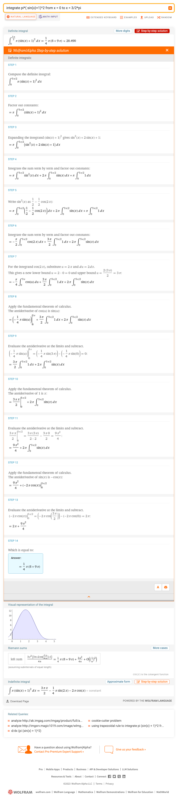

# Übungen

```{admonition} Übung 2.1
:class: miniexercise
Berechnen Sie den Mittelwert der Funktion $f(x)=\frac{1}{2}x^2 +1$ im Intervall $[0,2]$.
```
````{admonition} Lösung
:class: minisolution, toggle
$$m = \frac{1}{2-0}\int_{0}^{2}\frac{1}{2}x^2 +1 \, dx = \frac{5}{3} \approx 1.6666$$
```{dropdown} Lösungsweg
<iframe width="560" height="315" src="https://www.youtube.com/embed/Y4cPEgR3LUg" title="YouTube video player" frameborder="0" allow="accelerometer; autoplay; clipboard-write; encrypted-media; gyroscope; picture-in-picture; web-share" allowfullscreen></iframe>
````

```{admonition} Übung 2.2
:class: miniexercise
Berechnen Sie den Mittelwert $\bar{f}$ der Funktion $f(x)=mx+n$ auf einem beliebigen Intervall $[a,b]$. Interpretieren Sie das Ergebnis geometrisch.
```

````{admonition} Lösung
:class: minisolution, toggle
$$\bar{f} = \frac{1}{2}\left(f(a)+f(b)\right) $$ 
Der Mittelwert der der linearen Funktion $f(x)=mx+n$ ist gerade das arithmetische Mittel der beiden Funktionswerte $f(a)$ und $f(b)$ an den Intervallgrenzen.
```{dropdown} Lösungsweg

```
````

```{admonition} Übung 2.3
:class: miniexercise
Berechnen Sie den Flächeninhalt $A$, der zwischen dem Graphen der Funktion 

$$f(x)=x^2-x$$

und der x-Achse eingeschlossen ist. Fertigen Sie zuerst eine Skizze an.
```

````{admonition} Lösung
:class: minisolution, toggle
$$A = \frac{1}{6}$$
```{dropdown} Lösungsweg

```
````

```{admonition} Übung 2.4
:class: miniexercise
Berechnen Sie den Flächeninhalt $A$, der zwischen dem Graphen der Funktion 

$$f(x)=x(x-1)(x-3)$$

und der x-Achse eingeschlossen ist. Fertigen Sie zuerst eine Skizze an.
```

````{admonition} Lösung
:class: minisolution, toggle
$$A = \frac{37}{12}$$
```{dropdown} Lösungsweg

```
````

```{admonition} Übung 2.5
:class: miniexercise
Berechnen Sie den Flächeninhalt $A$, der zwischen den beiden Graphen der Funktionen 

$$f(x)=-\frac{1}{4}x^2+16 \quad \text{ und } \quad g(x)=-3x$$

eingeschlossen ist. Fertigen Sie zuerst eine Skizze an.
```

````{admonition} Lösung
:class: minisolution, toggle
$$A = \frac{1000}{3}=333.33$$
```{dropdown} Lösungsweg

```
````

```{admonition} Übung 2.6
:class: miniexercise
Berechnen Sie den Flächeninhalt $A$, der zwischen den beiden Graphen der Funktionen 

$$f(x)=-x^2+2x+\frac{1}{2} \quad \text{ und } \quad g(x)=x+2$$

und den parallelen Geraden $x=-2$ und $x=\frac{5}{2}$ eingeschlossen ist. Fertigen Sie zuerst eine Skizze an.
```

````{admonition} Lösung
:class: minisolution, toggle
$$A = \frac{27}{2}= 13.5$$
```{dropdown} Lösungsweg

```
````

```{admonition} Übung 2.7
:class: miniexercise
Berechnen Sie den Flächeninhalt $A$, der zwischen den beiden Graphen der Funktionen 

$$f(x)=-3x^2+x-1 \quad \text{ und } \quad g(x)=4\cdot (x-\frac{1}{4})^2-\frac{5}{4}$$

eingeschlossen ist. Fertigen Sie zuerst eine Skizze an.
```

````{admonition} Lösung
:class: minisolution, toggle
$$A = \frac{9}{98}\approx 0.091837$$
```{dropdown} Lösungsweg

```
````

```{admonition} Übung 2.8
:class: miniexercise
Berechnen Sie den Flächeninhalt $A$, der zwischen den beiden Graphen der Funktionen 

$$f(x)=2\sin(x) \quad \text{ und } \quad g(x)=-\frac{4\sqrt{2}}{3\pi}x + \frac{4\sqrt{2}}{3}$$

eingeschlossen ist. Fertigen Sie zuerst eine Skizze an.
```

````{admonition} Lösung
:class: minisolution, toggle
$$A = 4+2\sqrt{2} - \frac{3\pi}{2\sqrt{2}}\approx 3.49626$$
```{dropdown} Lösungsweg

```
````

```{admonition} Übung 2.9
:class: miniexercise
Berechnen Sie die Bogenlänge $L$ der Funktion $f(x)=x$ im Intervall $[0,1]$.
```

````{admonition} Lösung
:class: minisolution, toggle
$$L = \sqrt{2} \approx 1.4142$$
```{dropdown} Lösungsweg

```
````

```{admonition} Übung 2.10
:class: miniexercise
Berechnen Sie die Bogenlänge $L$ der Funktion $f(x)=x^{\frac{3}{2}}$ im Intervall $[0,1]$.
```

````{admonition} Lösung
:class: minisolution, toggle
$$L \approx 1.4397$$
```{dropdown} Lösungsweg

```
````

```{admonition} Übung 2.11
:class: miniexercise
Berechnen Sie das Volumen $V$ des Rotationskörpers, das entsteht, wenn die Funktion $f(x)=-x^2+4$ im Intervall $[-2,2]$ um die x-Achse gedreht wird.
```

````{admonition} Lösung
:class: minisolution, toggle

$$V = 2\pi\cdot \frac{256}{15}\approx 107.23$$
```{dropdown} Lösungsweg


```
````

```{admonition} Übung 2.12
:class: miniexercise
Berechnen Sie das Volumen $V$ des Rotationskörpers, das entsteht, wenn die Funktion $f(x)=\sin(x)+1$ im Intervall $[0,\frac{3\pi}{2}]$ um die x-Achse gedreht wird.
```

````{admonition} Lösung
:class: minisolution, toggle

$$V = \pi\left((\frac{3\pi}{2}-0+\frac{3\pi}{4})-(0-2+0)\right)\approx 28.4898$$
```{dropdown} Lösungsweg


```
````