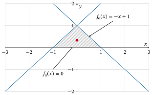

# Übungen

```{admonition} Übung 9.1
:class: miniexercise
Berechnen Sie das Doppelintegral 

$$\int_{x=0}^{x=1}\left(\int_{y=-x}^{y=x} xy+1 \, dy\right) \, dx.$$
```
````{admonition} Lösung
:class: minisolution, toggle
$$\int_{x=0}^{x=1}\left(\int_{y=-x}^{y=x} xy+1 \, dy\right) \, dx = 1$$
```{dropdown} Lösungsweg
\begin{align*}
\int_{x=0}^{x=1}\left(\int_{y=-x}^{y=x} xy+1 \, dy \right)\, dx 
&= \int_{x=0}^{x=1} \left[\frac{1}{2}xy^2+y \right]_{y=-x}^{y=x} \, dx = \\
&= \int_{x=0}^{x=1} \left(\frac{1}{2}xx^2+x\right)-\left(\frac{1}{2}x(-x)^2+(-x)\right)\, dx = \\
&= \int_{x=0}^{x=1} 2x\, dx = \\
&= \big[ x^2\big]_{x=0}^{x=1} = 1-0 = 1.
\end{align*}
```
````

```{admonition} Übung 9.2
:class: miniexercise
Berechnen Sie das Doppelintegral 

$$\int_{x=0}^{x=2\pi}\left(\int_{y=-\sin(x)-1}^{y=\sin(x)+1} xy+1 \, dy\right) \, dx.$$
```
````{admonition} Lösung
:class: minisolution, toggle
$$\int_{x=0}^{x=2\pi}\left(\int_{y=-\sin(x)-1}^{y=\sin(x)+1} xy+1 \, dy\right) \, dx = 4\pi$$
```{dropdown} Lösungsweg
\begin{align*}
\int_{x=0}^{x=2\pi}\left(\int_{y=-\sin(x)-1}^{y=\sin(x)+1} xy+1 \, dy\right) \, dx
&= \int_{x=0}^{x=2\pi} \left[ \frac{1}{2}xy^2+y\right]_{y=-\sin(x)-1}^{y=\sin(x)+1} \, dx = \\
&= \int_{x=0}^{x=2\pi} \left(\frac{1}{2}x (\sin(x)+1)^2 + (\sin(x)+1) \right) 
    - \left(\frac{1}{2}x (-\sin(x)-1)^2 - \sin(x) -1 \right) \, dx = \\
&= \int_{x=0}^{x=2\pi} 2\sin(x)+2 \, dx = \\
&= 2 \big[-\cos(x)+x \big]_{x=0}^{x=2\pi} = \\
&= 2\left(-\cos(2\pi) + 2\pi \right)-2 \left(-\cos(0)+0 \right) = \\
&= -2 + 4\pi + 2 = 4\pi.    
\end{align*}
```
````

```{admonition} Übung 9.3
:class: miniexercise
Berechnen Sie das Doppelintegral 

$$\int_{x=0}^{x=2\pi}\left(\int_{y=-\sin(x)-1}^{y=\sin(x)+1} x \, dy\right) \, dx.$$
```
````{admonition} Lösung
:class: minisolution, toggle
$$\int_{x=0}^{x=2\pi}\left(\int_{y=-\sin(x)-1}^{y=\sin(x)+1} x \, dy \right)\, dx = 4(\pi^2-\pi)$$
```{dropdown} Lösungsweg
\begin{align*}
\int_{x=0}^{x=2\pi}\left(\int_{y=-\sin(x)-1}^{y=\sin(x)+1} x \, dy\right) \, dx
&= \int_{x=0}^{x=2\pi} \big[xy \big]_{y=-\sin(x)-1}^{y=\sin(x)+1} \, dx = \\
&= \int_{x=0}^{x=2\pi} \left(x(\sin(x)+1) \right) - \left(x (-\sin(x)-1) \right) \, dx = \\
&= 2 \int_{x=0}^{x=2\pi} x\cdot (\sin(x)+1) \, dx = \\
&= 2 \big[x \cdot(-\cos(x)+x) \big]_{x=0}^{x=2\pi} - 2\int_{x=0}^{x=2\pi} -\cos(x)+x \, dx = \\
&= 2\cdot 2\pi ((-1)+2\pi) + 2\big[\sin(x)\big]_{x=0}^{x=2\pi} - 2 \left[\frac{1}{2}x^2 \right]_{x=0}^{x=2\pi} = \\
&= -4\pi + 8\pi^2 + (0-0) - 4\pi^2 = \\
&= 4\pi^2-4\pi.
\end{align*}
```
````

```{admonition} Übung 9.4
:class: miniexercise
Berechnen Sie das Doppelintegral 

$$\int_{x=0}^{x=1}\left(\int_{y=0}^{y=x} \sqrt{xy} \, dy\right) \, dx.$$
```
````{admonition} Lösung
:class: minisolution, toggle
$$\int_{x=0}^{x=1}\left(\int_{y=0}^{y=x} \sqrt{xy} \, dy \right) \, dx = \frac{2}{9}$$
```{dropdown} Lösungsweg
\begin{align*}
\int_{x=0}^{x=1}\left(\int_{y=0}^{y=x} \sqrt{xy} \, dy \right) \, dx 
&= \int_{x=0}^{x=1} \left[ \sqrt{x}\frac{2}{3}y^{\frac{3}{2}}\right]_{y=0}^{y=x} \, dx = \\
&= \int_{x=0}^{x=1} \frac{2}{3}x^2 \, dx = \\
&= \left[\frac{2}{9}x^3 \right]_{x=0}^{x=1} = \\
&= \frac{2}{9}.
\end{align*}
```
````

```{admonition} Übung 9.5
:class: miniexercise
Berechnen Sie das Doppelintegral 

$$\int_{x=0}^{x=2\pi}\left(\int_{y=x(x-\pi)^2(x-2\pi)}^{y=\sin(x)^2} 1 \, dy \right)\, dx.$$
```
````{admonition} Lösung
:class: minisolution, toggle
$$\int_{x=0}^{x=2\pi}\left(\int_{y=x(x-\pi)^2(x-2\pi)}^{y=\sin(x)^2} 1 \, dy \right)\, dx = \pi + \frac{4}{15}\pi^5$$
```{dropdown} Lösungsweg
\begin{align*}
\int_{x=0}^{x=2\pi}\left(\int_{y=x(x-\pi)^2(x-2\pi)}^{y=\sin(x)^2} 1 \, dy \right)\, dx
&= \int_{x=0}^{x=2\pi} \big[ y \big]_{y=x(x-\pi)^2(x-2\pi)}^{y=\sin^2(x)} \, dx = \\
&= \int_{x=0}^{x=2\pi} \sin^2(x) - x (x-\pi)^2 (x-2\pi) \, dx
\end{align*}
Nebenrechnung für den zweiten Integranden:
\begin{align*}
x (x-\pi)^2 (x-2\pi) 
&= (x^2-2\pi x + \pi^2)\cdot (x^2-2\pi x) = \\
&= x^4 -2\pi x^3 + \pi^2 x^2 - 2\pi x^3 + 4\pi^2x^2 - 2\pi^3x = \\
&= x^4 - 4\pi x^3 + 5\pi^2 x^2 - 2\pi^3 x 
\end{align*}
Eingesetzt in das obige Integral gilt dann zusammen mit dem Trick $\sin^2(x) =\frac{1}{2}-\frac{1}{2}\cos(2x)$ (Additionstheorem bzw. Doppelwinkelfunktion)
\begin{align*}
\int_{x=0}^{x=2\pi}\left(\int_{y=x(x-\pi)^2(x-2\pi)}^{y=\sin(x)^2} 1 \, dy \right)\, dx
&= \int_{x=0}^{x=2\pi} \sin^2(x) \, dx - \int_{x=0}^{x=2\pi} x^4 - 4\pi x^3 + 5\pi^2 x^2 - 2\pi^3x \, dx = \\
&= \frac{1}{2} \left[x-\sin(x)\cos(x) \right]_{x=0}^{x=2\pi} - \left[\frac{1}{5}x^5 - \pi x^4 + \frac{5}{3}\pi^2x^3 - \pi^3 x^2 \right]_{x=0}^{x=2\pi} = \\
&= \frac{1}{2}2\pi - \left(\frac{1}{5}(2\pi)^5 - \pi(2\pi)^4 + \frac{5}{3}\pi^2(2\pi)^3 - \pi^3 (2\pi)^2 \right) = \\
&= \pi - \frac{4}{15}\pi^5. 
\end{align*}
```
````

```{admonition} Übung 9.6
:class: miniexercise
Berechnen Sie den Schwerpunkt der Fläche eines Dreiecks mit den Koordinaten $(1,0)$, $(0,1)$ und $(-1,0)$. Machen Sie sich dazu eine Skizze des Integrationsgebietes.
```
````{admonition} Lösung
:class: minisolution, toggle
Schwerpunkt $S(0, \frac{1}{3})$
```{dropdown} Lösungsweg
Zuerst fertigen wir eine Zeichnung an.



Die x-Koordinate des Schwerpunkts ist Null, weil das Dreieck symmetrisch zur
y-Achse ist. Diese Symmetrie nutzen wir auch aus, um die y-Koordinate des
Schwerpunkts zu berechnen. Anstatt das Integral von $x=-1$ bis $x=1$ zu
berechnen und dabei zwei verschiedene Randfunktionen betrachten zu müssen,
betrachten wir nur die rechte Hälfte des Dreiecks. Der Schwerpunkt der rechten
Hälfte in y-Richtung muss gleich dem Schwerpunkt des gesamten Dreiecks in
y-Richtung sein.

Die Formel zur Berechnung der y-Koordinate des Schwerpunkts lautet also

$$y_S = \frac{1}{A} \int_{x=0}^{x=1} \left( \int_{y=0}^{y=-x+1} y \, dy \right) \, dx.$$

Zuerst berechnen wir $A$ mit der Formel $A = \frac{1}{2} g h$ mit der Grundseite $g$ und der Höhe $h$. Aus der Zeichnung lesen wir ab: $g = 1$ und $h=1$. Also ist der Flächeninhalt des rechten Dreiecks 

$$A=\frac{1}{2}.$$

Alternativ hätten wir auch den Flächeninhalt mit einem Doppelintegral berechnen können. Das innere Integral $I(x)$ ist

\begin{align*}
I(x) 
&= \int_{y=0}^{y=-x+1} y \, dy = \\
&= \left[ \frac{1}{2}y^2 \right]_{y=0}^{y=-x+1} = \\
&= \frac{1}{2} (-x+1)^2 = \\
&= \frac{1}{2}x^2 - x + \frac{1}{2}. 
\end{align*}

Eingesetzt in das äußere Integral erhalten wir

\begin{align*}
\int_{x=0}^{x=1} \left( \int_{y=0}^{y=-x+1} y \, dy \right) \, dx
&= \int_{x=0}^{x=1} \frac{1}{2}x^2 - x + \frac{1}{2} \, dx = \\
&= \left[\frac{1}{6} x^3 - \frac{1}{2}x^2 + \frac{1}{2} x \right]_{x=0}^{x=1} = \\
&= \frac{1}{6} - \frac{1}{2} + \frac{1}{2} = \frac{1}{6}.
\end{align*}

Alles zusammengesetzt ist also die y-Koordinate des Schwerpunkts

\begin{align*}
y_S 
&= \frac{1}{A}\int_{x=0}^{x=1} \left( \int_{y=0}^{y=-x+1} y \, dy \right) \, dx = \\
&= \frac{1}{\frac{1}{2}} \cdot \frac{1}{6} = \frac{1}{3}.
\end{align*}

Damit ist der Schwerpunkt des Dreiecks $S(0, \frac{1}{3})$.
```
````

```{admonition} Übung 9.7
:class: miniexercise
Berechnen Sie den Schwerpunkt der Fläche, die durch die beiden Kurven $f(x)=x^2-4x-1$ und $g(x)=2x-6$ eingeschlossen wird. Machen Sie sich dazu eine Skizze des Integrationsgebietes. 
```
````{admonition} Lösung
:class: minisolution, toggle
Schwerpunkt $S(3, -\frac{8}{5})$
```{dropdown} Lösungsweg
Zuerst fertigen wir eine Zeichnung an:


Als erstes werden die Schnittstellen berechnet:

$$f_o(x) = f_u(x) \quad \Rightarrow \mathbb{L} = \{1,5\}.$$

Danach wird der Flächeninhalt $A$ berechnet:

\begin{align*}
A 
&= \int_{x=1}^{x=5} \left( \int_{y=x^2-4x-1}^{y=2x-6} 1 \, dy\right) \, dx = \\
&= \int_{x=1}^{x=5} \big[ y \big]_{y=x^2-4x-1}^{y=2x-6} \, dx = \\
&= \int_{x=1}^{x=5} -x^2+6x-5 \, dx = \\
&= \left[-\frac{1}{3}x^3 + 3x^2 - 5x \right]_{x=1}^{x=5} = \\
& = \frac{32}{3} \\
\end{align*}

Als nächstes wird die x-Koordinate des Schwerpunkts berechnet:

\begin{align*}
x_S 
&= \frac{1}{A} \int_{x=1}^{x=5} \left(\int_{y=x^2-4x-1}^{y=2x-6} x \, dy \right) \, dx = \\
&= \frac{3}{32} \int_{x=1}^{x=5} \left[ xy \right]_{y=x^2-4x-1}^{y=2x-6} \, dx = \\
&= \frac{3}{32} \int_{x=1}^{x=5} -x^3+6x^2-5x \, dx = \\
&= \frac{3}{32} \left[-\frac{1}{4}x^4+2x^3-\frac{5}{2}x^2\right]_{x=1}^{x=5} = \\
&= \frac{3}{32} \cdot 32 = 3.
\end{align*}

Und nun noch die y-Koordinate des Schwerpunktes:

\begin{align*}
y_S 
&= \frac{1}{A} \int_{x=1}^{x=5} \left( \int_{y=x^2-4x-1}^{y=2x-6} y \, dy \right) \, dx = \\
&= \frac{3}{32} \int_{x=1}^{x=5} \left[ \frac{1}{2}y^2 \right]_{y=x^2-4x-1}^{y=2x-6} \, dx = \\
&= \frac{3}{32} \int_{x=1}^{x=5} -\frac{1}{2} x^4 + 4x^3 - 5x^2 - 16x + \frac{35}{2} \, dx = \\
&= \frac{3}{32} \left[-\frac{1}{10}x^5 + x^4 - \frac{5}{3}x^3-8x^2+\frac{35}{2}x \right]_{x=1}^{x=5} = \\
&= \frac{3}{32} \cdot \left( -\frac{256}{15}\right) = -\frac{8}{5} = -1.6.
\end{align*}
```
````


